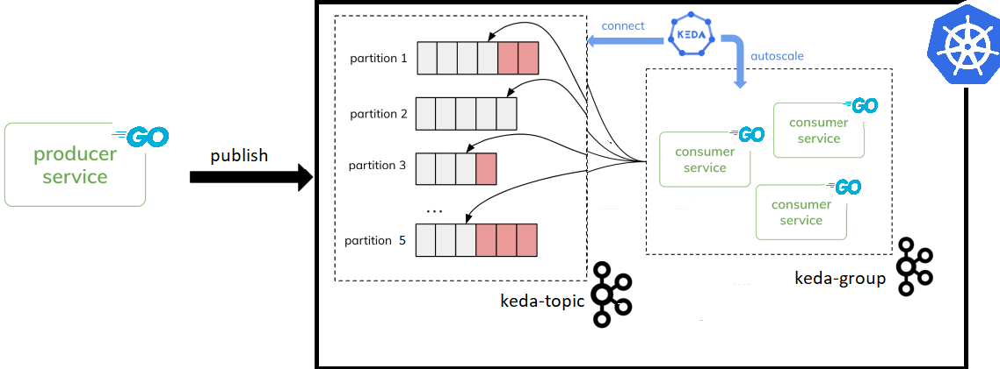

# POC-KEDA

This repository contains all of the files used in the demonstration of event-driven workload scaling in k8s using Keda.

All related documentation is available on the Syntio's [confluence page](https://syntio.atlassian.net/wiki/spaces/SL/pages/2365685818/Keda).

## Components

There are three folders with following contents in this repository:
- Kafka consumer
- Kafka producer
- yaml files for deployment and configuration

## Architecture

Image below shows a POC design.

